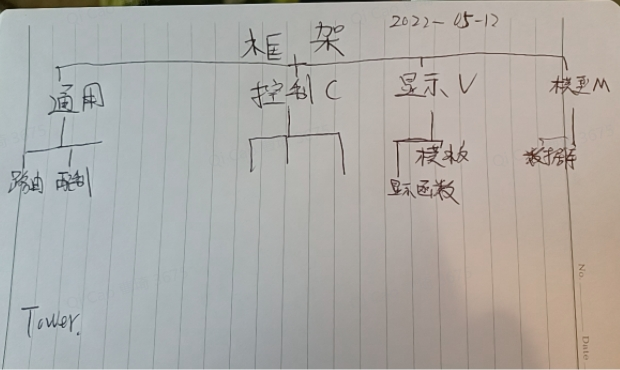

# WebHotel
## Preface
**2022-05-12**,I'm locking down in the Heyuan Royal Garden.Because I'm too boring to want to write a web  framework.So it is named WebHotel.

I'm inner peace.I'm lying flat.

## Framwork Diagram


## Core
### Router
### Log
### Debuger
使用tracing
```rust
if std::env::var_os("RUST_LOG").is_none() {
    std::env::set_var("RUST_LOG", "webhotel=debug");//webhotel 要使用你的项目名称
}
```